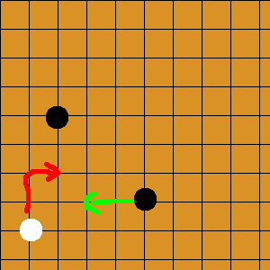
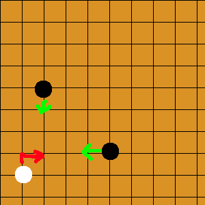

# Stone Catch Game - Working backwards from the final state

Date: 11-14-2024

Author: [stonejjun](stonejjun)

[Problem Source](https://codeforces.com/gym/102984)

[Really helpful blog](https://www.cnblogs.com/Flying2018/p/gym102984.html)

Side note, this was also part of Columbia's WF Training Camp held on August 2024. Thanks Yonghwan! It was really fun doing 5 hours every day over the summer with 0 responsibilities :D

---

### Statement:

Infinite plane. White has a stone at (0, 0). Black has any number of stones situated at non-negative coordinates (you're given this in input).

- A move for white consists of incrementing their x or y position of their stone by 1. 
- A move for black consists of choosing one of their stones, and decrementing their x or y position by 1.  
- Multiple stones can occupy the same position.

Black wins if white's stone and black's stones coincide at any point. White wins if he can play the game infinitely. White moves first. Determine who wins. 

---

### Approach 1

Call the "main diagonal" the diagonal consisting of the set of squares (x + M, y + M), where (x,y) is white's stone location, and M is any non-negative constant. 

When black has 1 stone, it's trivial. 

When black has 2+ stones, black wins if he can get a piece on the main diagonal, no matter who's turn it is. Furthermore, motivated by the 1 stone case, black needs a stone on both sides of the main diagonal to win. 

This motivates a solution where you want to look at one stone below and one stone above the diagonal. Furthermore, this also means that stones above the diagonal only want to move down, and stones below the diagonal only want to move left

smol brain

It's actually not entirely clear to me that you wouldn't want to use 3+ stones; there's no clear optimal pair of stones, so it doesn't seem out of the blue to push temporarily with 1 stone and then use another once you've goaded them to a better position. Perhaps the nature of there being only 1 direction you can move for each stone shows some kind of exchange argument though. 

(**After reading blog**) You can work backwards from the final state here though - because moves are independent, and the losing state definitely involves black clamping white from both sides, clearly any extra moves used to goad white are wasted moves then. 

Unfortunately, at this point, I pulled a Thomas. I made the assumption that black only moves 1 piece, while letting the other be a barrier;

   

the logic being that white has to outmanuever both pieces by getting to a strictly higher x or y coordinate (true). But obviously black wins by just doing this 

and wasted hours :D 

---

### Approach 2: 

I tried to show some optimality arguments by showing that some stones were strictly better than others. We can think of each black stone as shooting a ray down the diagonal; this sort of turns it into a 1D problem since "all we care about" is if we can clamp on white. But obviously the rays only shoot forwards so it does complicate some things. 

This does mean that some stones genuinely are strictly worse though, e.g. (2, 5) will just always cover more ground than (1, 6), so it does form some kind of convex frontier. But couldn't really get anywhere with this. 

### Solution

The key observation is to work backwards from the ending state. Go read the chinese guy's blog for more details though. Then you work out some formulas, realize the degenerate case is pretty much the same, and you're done. Never bothered to implement properly the solution after this lol. 

lol

I genuinely don't know what that means. I remember walking around in the park and coming naturally to this conclusion at one point, but now I'm confused. Yes sure, I can read the blog, logically believe that the minimal winning state is (2, 2), but I recall feeling it much stronger a few months ago. 

I feel like there's an important step here that I'm missing (for myself) here which I wanted to outline by writing this blog that really justifies the "神仙题" label, which is why I wrote a whole blog on this in the first place, including my mishaps. I'll just leave this unfinished I guess...

