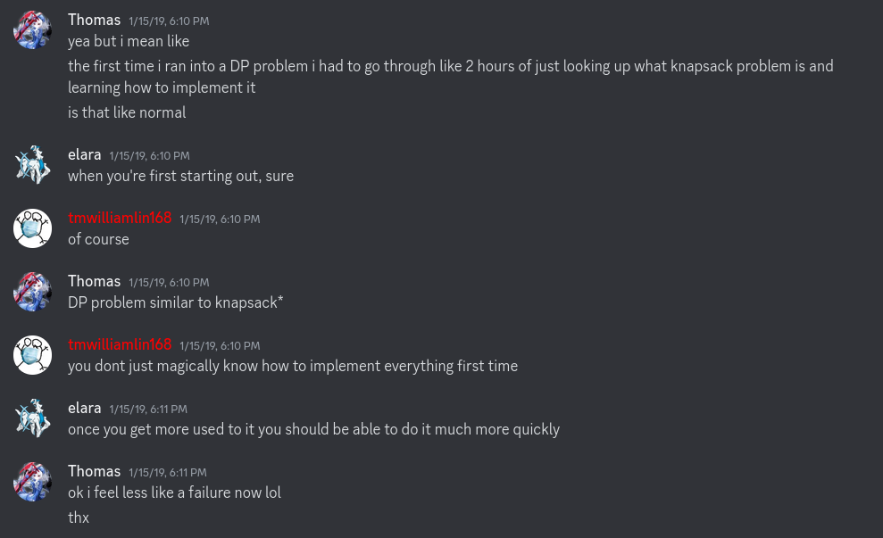

# Dynamic Programming

Date: 12-3-2024

---

Wow, what a throwback to my high school days. I just looked through the USACO server and found this conversation from myself:

Ahh, how cringe lmao... I mean it's classic X / Y problem here mixed in with insecurity, that's pretty funny. 

But it does raise a good point, that just learning DP from the tables is such a bad way to learn about dynamic programming. 

The way I conceptualize it now, is that dynamic programmign is basically trying to build out solutions with brute force, which would be equivalent to the naive exponential algorithm. But then you notice some common patterns to reduce the number of states you actually have to consider, by noticing they behave mostly the same. 

For example, I would teach knapsack by tediously going through all possible state transitions in the tree, then show the observation that, hey, weight doesn't matter. 

(This also requires the observer to understand how to write the brute force solution for the knapsack solution, so it puts them in the right frame of mind. I'm not sure if people even understand that part of the knapsack solution initially, since it can seem so foreignly motivated. That's a hidden assumption that I think just gets looked over.)

Obviously the concept extends but that's how I've conceptualized DP; also it's pretty much the same concept as some expected value problems, the idea of "state" and trying to minimally describe the system just shows up a lot I guess. 

That kind of thing obviously doesn't show up in software engineering much; there's not often some nice property about the system that you can observe to reduce it; I'd be very sussed out if you could find that kind of property about user data and such. More often, it's just, "do it, and throw on some classic optimizations like caching and such if necessary".  